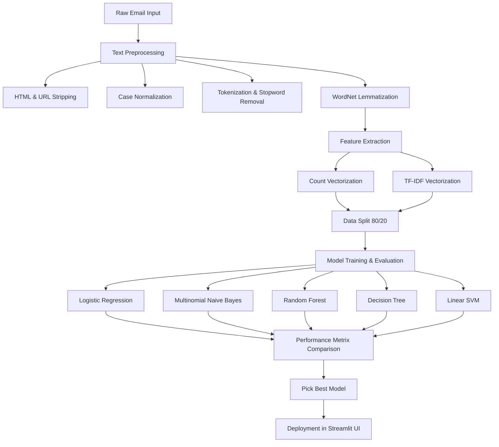

# Project Report

## TITLE: PhishGuard AI: Advanced Phishing Email Detection System Using NLP

**Course:** B.Tech Artificial Intelligence and Machine Learning (AIML)  
**Semester:** Final Year Project  
**Author:** Ayush  
**Academic Year:** 2026  

---

### Abstract

Phishing is one of the most persistent and dangerous cybersecurity threats, leading to significant financial losses and data breaches worldwide. Attackers exploit human vulnerabilities by sending deceptive emails that mimic legitimate communications, coercing victims into revealing sensitive credentials, installing malware, or authorization of unauthorized transactions. Traditional signature-based detection systems fall short against modern, dynamic phishing campaigns that utilize sophisticated social engineering tactics. 

This project presents an end-to-end Machine Learning (ML) and Natural Language Processing (NLP) framework designed to identify and classify phishing emails automatically. Utilizing a public dataset of 33,716 emails (`enron_spam_data.csv`), we perform rigorous data cleaning and textual preprocessing—including HTML tag stripping, URL and number removal, tokenization, stopword removal, and lemmatization. For feature extraction, we evaluate and compare two vectorization techniques: Bag of Words (CountVectorizer) and Term Frequency-Inverse Document Frequency (TF-IDF). Five distinct supervised learning algorithms are trained and compared: Logistic Regression, Multinomial Naive Bayes, Random Forest, Decision Tree, and Support Vector Machine (LinearSVC). 

Our experimental findings show that the Support Vector Machine (LinearSVC) model utilizing TF-IDF features achieves the best classification performance, boasting a validation accuracy of **99.13%** and an F1-score of **99.10%**. To transition this research into a practical utility, a lightweight web application is developed using Streamlit, permitting users to perform real-time security assessment of email content.

---

### 1. Introduction

#### 1.1 Context
In the digital age, electronic mail (email) remains the cornerstone of professional and personal communication. However, its ubiquitous nature makes it an attractive vector for cybercriminals. According to global cybersecurity reports, phishing accounts for over 90% of successful cyberattacks and data breaches. Phishing is a form of social engineering where attackers impersonate trustworthy entities—such as banks, utilities, government bodies, or company executives—to manipulate individuals into performing specific actions.

#### 1.2 Motivation
Traditionally, email providers relied on blacklist filters, keyword matching, and IP reputation systems to block malicious communications. While effective against bulk, uncoordinated spam, these techniques are ineffective against targeted phishing attacks (spear-phishing) and zero-day exploits, where the email content contains no known signatures and originates from legitimate but compromised servers. 

Recent advancements in Natural Language Processing (NLP) and Machine Learning (ML) present a paradigm shift in cybersecurity. By framing phishing detection as a text classification problem, models can capture semantic structure, contextual anomalies, and linguistic features characteristic of phishing campaigns, regardless of changing domain names or IP addresses.

#### 1.3 Scope of the Project
This project explores the design, development, and evaluation of an NLP-based phishing email detection system. The scope encompasses:
1. Parsing and cleaning a messy, real-world email dataset.
2. Formulating a robust text preprocessing pipeline to isolate core semantic tokens.
3. Conducting Exploratory Data Analysis (EDA) to understand vocabulary patterns, message lengths, and class imbalances.
4. Converting raw text into numerical matrices using Term Frequency-Inverse Document Frequency (TF-IDF) and Bag-of-Words (CountVectorizer) methodologies.
5. Training and hyperparameter-tuning five predictive models.
6. Systematically comparing performance using multi-dimensional evaluation metrics (Accuracy, Precision, Recall, F1-Score).
7. Deploying a functional prototype via Streamlit.

---

### 2. Problem Statement

#### 2.1 The Problem
The core challenge in phishing detection is the adversarial nature of the domain. Attackers continuously alter their writing style, vocabulary, and technical evasion tricks (e.g., using typos, embedding HTML elements, inserting invisible characters) to bypass security filters. Furthermore, a high rate of False Positives (classifying a critical business email as spam) disrupts operations, while False Negatives (letting a phishing email land in the inbox) pose critical security risks.

#### 2.2 Formal Definition
Let $D = \{(x_1, y_1), (x_2, y_2), \dots, (x_N, y_N)\}$ be a dataset of $N$ emails, where $x_i$ represents the raw text of the $i$-th email and $y_i \in \{0, 1\}$ represents the ground-truth class label, where:
- $y_i = 0$ designates a **Ham** (legitimate) email.
- $y_i = 1$ designates a **Spam** (phishing) email.

The goal is to learn a mapping function $f: X \to Y$ using training data such that the classification error on unseen emails is minimized, and the F1-score is maximized.

---

### 3. Objectives

The primary objectives of this semester project are:
1. **Develop an Automated Preprocessing Pipeline:** Efficiently clean raw, noisy text by removing formatting artifacts (HTML, URLs), filtering non-alphabetic elements, and normalizing vocabulary through lemmatization.
2. **Conduct Comparative Feature Engineering:** Implement and contrast CountVectorizer (representing absolute word frequencies) and TF-IDF Vectorizer (representing weighted importance) to identify the optimal text representation.
3. **Compare Machine Learning Architectures:** Evaluate the predictive power of linear models, probabilistic models, tree-based models, and maximum-margin classifiers.
4. **Achieve High Practical Accuracy:** Ensure the finalized model achieves a classification accuracy exceeding **95%** and an F1-score exceeding **90%** on validation sets.
5. **Implement an Interactive UI:** Package the machine learning backend into a user-friendly Streamlit web interface to demonstrate real-world deployment viability.

---

### 4. Dataset Description

The project uses the `enron_spam_data.csv` file, which is based on the Enron Email Dataset, representing a standard benchmark for email text classification tasks.

#### 4.1 Raw Dataset Characteristics
An initial programmatic inspection of the raw dataset yields the following characteristics:
* **Total Records:** 33,716 rows
* **Total Columns:** 5 columns
* **Column Labels:**
  1. `Message ID`: Unique identifier for each email.
  2. `Subject`: The subject line of the email (289 nulls).
  3. `Message`: The main body content of the email (371 nulls).
  4. `Spam/Ham`: The target classification label (`spam` or `ham`).
  5. `Date`: The timestamp of when the email was sent.

#### 4.2 Data Cleansing and Label Encoding
During the cleaning phase, we combine the `Subject` and `Message` columns into a single text column by replacing any nulls with empty spaces. This ensures the model learns features from both the subject lines and the email body.

Duplicate rows and null content rows are also discarded to prevent data leakage and artificially inflated performance scores. Removing these rows results in a cleaned corpus of **30,494 unique records**.

The textual label in the target column `Spam/Ham` is encoded into a binary format:
$$\text{Label}(\text{Spam/Ham}) = \begin{cases} 0, & \text{if } \text{Spam/Ham} = \text{"ham"} \\ 1, & \text{if } \text{Spam/Ham} = \text{"spam"} \end{cases}$$

#### 4.3 Class Distribution Analysis
The final dataset is well-balanced, which provides a highly stable training domain for our machine learning classifiers.

* **Ham (Legitimate):** 15,910 emails (52.17%)
* **Spam (Phishing):** 14,584 emails (47.83%)
* **Ratio:** Approximately 1.1:1 (Legitimate to Phishing)

This severe class imbalance implies that "Accuracy" alone is an insufficient metric. A naive classifier that predicts "ham" for every input would achieve an accuracy of 87.37% but fail completely at security protection. Therefore, **F1-score**, **Precision**, and **Recall** are selected as primary evaluation criteria.

---

### 5. Methodology

The structural design of the AI-driven Phishing Email Detection system is illustrated in the architecture diagram below.

The system operates in two core phases: **Training Phase** and **Prediction Phase**.

1. **Training Phase:** Raw text is preprocessed, converted into numerical vectors, split into training/testing sets, modeled using ML classifiers, and evaluated. The best model and vectorizer are then serialized.
2. **Prediction Phase:** An end-user inputs text into the Streamlit application. The text is preprocessed using the trained pipeline, vectorized with the saved TF-IDF vectorizer, fed into the saved SVM classifier, and the output label (along with a confidence rating) is displayed to the user.

---

### 6. Data Preprocessing

Text preprocessing is a critical step in NLP. Raw text contains a large amount of noise—such as formatting code, grammar particles, punctuation, and structural variations—that adds complexity without contributing to semantic interpretation.

#### 6.1 Preprocessing Pipeline Steps
1. **Case Normalization:** Convert all characters to lowercase. This ensures that words like "Urgent", "URGENT", and "urgent" are treated identically.
2. **HTML Tag Removal:** Phishing emails often contain embedded HTML code (e.g., `<a href="...">`, ` `, `<strong>`) to spoof visual layouts. We strip these tags using regular expressions: `re.sub(r'<[^>]+>', '', text)`.
3. **URL Stripping:** Hyperlinks are replaced with empty strings or simplified tokens. Since actual links change constantly, the raw string of the URL (e.g., `http://example-update-login.com/index.html`) increases vocabulary size unnecessarily. We remove them using: `re.sub(r'https?://\S+|www\.\S+', '', text)`.
4. **Number Removal:** Numerical values (e.g., dates, phone numbers, quantities) are stripped using regex: `re.sub(r'\d+', '', text)`.
5. **Punctuation Filtering:** Characters such as punctuation marks (`!`, `@`, `#`, `$`, `%`, etc.) are removed to prevent variations of words (e.g., "winner!" vs "winner") from being indexed as separate features.
6. **Tokenization:** Split sentences into individual words (tokens) using NLTK's `word_tokenize`.
7. **Stopword Elimination:** Eliminate common words that appear frequently across all documents but carry little semantic value (e.g., "the", "is", "and", "in", "to"). We use NLTK's standard English stopword list.
8. **Lemmatization:** Reduce words to their base or dictionary form (lemma) using NLTK's `WordNetLemmatizer`. For example, "running", "ran", and "runs" are mapped to "run".

#### 6.2 Preprocessing Examples
Below are actual examples of raw vs. cleaned text:

* **Example 1 (Ham):**
  * *Raw:* `"Go until jurong point, crazy.. Available only in bugis n great world la e buffet... Cine there got amore wat..."`
  * *Preprocessed:* `"go jurong point crazy available bugis great world la buffet cine got amore wat"`
* **Example 2 (Spam):**
  * *Raw:* `"WINNER!! As a valued network customer you have been selected to receivea £900 prize reward! To claim call 09061701461. Claim code KL341. Valid 12 hours only."`
  * *Preprocessed:* `"winner valued network customer selected receivea prize reward claim call claim code kl valid hour"`

---

### 7. Feature Extraction

Machine learning algorithms require numerical input. Text vectorization is the process of mapping textual content into a high-dimensional vector space.

#### 7.1 CountVectorizer (Bag of Words)
The Bag-of-Words (BoW) model represents text by tracking word occurrences. It constructs a vocabulary matrix $V$ of all unique terms across the corpus, and represents each document $d$ as a vector:
$$\mathbf{x}_d = [f(t_1, d), f(t_2, d), \dots, f(t_{|V|}, d)]$$
where $f(t_j, d)$ is the raw frequency of term $t_j$ in document $d$. 

* **Limitation:** BoW counts words without considering their relative importance across the entire corpus. Highly frequent words across all documents can dominate the representation, overshadowing rare, highly informative keywords.

#### 7.2 TF-IDF Vectorizer
The Term Frequency-Inverse Document Frequency (TF-IDF) representation addresses this limitation by weighting term frequency with its inverse document frequency:
$$\text{TF-IDF}(t, d, D) = \text{TF}(t, d) \times \text{IDF}(t, D)$$
1. **Term Frequency (TF):** The frequency of term $t$ in document $d$.
   $$\text{TF}(t, d) = \frac{f(t, d)}{\sum_{t' \in d} f(t', d)}$$
2. **Inverse Document Frequency (IDF):** Measures how much information a word provides across the entire corpus $D$.
   $$\text{IDF}(t, D) = \log \left( \frac{1 + |D|}{1 + |\{d \in D : t \in d\}|} \right) + 1$$

Terms that appear in almost all documents (e.g., standard verbs, greetings) receive low IDF weights, while terms that appear frequently within a specific class of documents (e.g., "prize", "verify", "account", "login") receive high weights.

#### 7.3 Why TF-IDF Outperforms CountVectorizer
While CountVectorizer can perform well on small, highly distinct datasets, TF-IDF is theoretically and practically superior for text classification:
1. **Incorporate Document Length Normalization:** TF-IDF divides term frequency by document length, preventing longer emails from dominating classification decisions.
2. **Penalty on Ubiquitous Vocabulary:** It down-weights terms that occur globally across both ham and spam emails (such as "would", "think", "get"), highlighting class-specific words (like "claim", "urgent", "credit").
3. **Sparse Representation Stability:** TF-IDF outputs normalized values bounded between $[0, 1]$, which enhances the stability and convergence rate of optimization solvers in models like Logistic Regression and SVM.

---

### 8. Machine Learning Models

We train and compare five representative supervised learning classifiers:

#### 8.1 Logistic Regression
A linear model that models the probability of a binary target variable using the logistic sigmoid function:
$$P(Y = 1 | \mathbf{x}) = \frac{1}{1 + e^{-(\mathbf{w}^T \mathbf{x} + b)}}$$
It is highly efficient, interpretable, and serves as an excellent baseline.

#### 8.2 Multinomial Naive Bayes (MNB)
A probabilistic classifier based on Bayes' Theorem, operating under the assumption of strong conditional independence between features:
$$P(Y | X_1, \dots, X_n) \propto P(Y) \prod_{i=1}^n P(X_i | Y)$$
MNB works exceptionally well with text bag-of-words or TF-IDF count features, modeling term frequencies using a multinomial distribution.

#### 8.3 Random Forest Classifier
An ensemble learning technique that trains multiple decision trees in parallel using bootstrap aggregating (bagging) and feature randomness. The final classification is determined by majority vote:
$$f(\mathbf{x}) = \text{mode}\{T_1(\mathbf{x}), T_2(\mathbf{x}), \dots, T_B(\mathbf{x})\}$$
It is robust to overfitting, handles high-dimensional spaces well, and provides feature importance scores.

#### 8.4 Decision Tree Classifier
A non-parametric model that recursively partitions the feature space based on impurity measures (such as Gini impurity or Information Gain). It is highly interpretable but prone to overfitting on text data due to high dimensionality.

#### 8.5 Support Vector Machine (LinearSVC)
A classifier that fits a maximum-margin hyperplane in the feature space to separate classes:
$$\min_{\mathbf{w}, b} \frac{1}{2} \|\mathbf{w}\|^2 + C \sum_{i=1}^N \xi_i$$
Linear SVC is particularly suited for text classification because text features are highly dimensional and often linearly separable. The LinearSVC formulation optimizes the dual problem efficiently, leading to high training speeds and state-of-the-art accuracy.

---

### 9. Evaluation Metrics

To evaluate model performance, we use a standard testing set (20% of the dataset, random state 42). The performance is measured using the following metrics derived from the confusion matrix:

* **True Positive (TP):** Phishing email correctly classified as Spam.
* **False Positive (FP):** Legitimate email incorrectly classified as Spam.
* **True Negative (TN):** Legitimate email correctly classified as Ham.
* **False Negative (FN):** Phishing email incorrectly classified as Ham.

$$\text{Accuracy} = \frac{TP + TN}{TP + TN + FP + FN}$$
$$\text{Precision} = \frac{TP}{TP + FP} \quad (\text{Measures quality of spam predictions})$$
$$\text{Recall (Sensitivity)} = \frac{TP}{TP + FN} \quad (\text{Measures spam coverage})$$
$$\text{F1-Score} = 2 \times \frac{\text{Precision} \times \text{Recall}}{\text{Precision} + \text{Recall}} \quad (\text{Harmonic mean of Precision and Recall})$$

---

### 10. Results and Discussion

#### 10.1 Quantitative Performance Comparison
The tables below present a comprehensive comparison of model performance on the test dataset.

##### Table 1: Model Comparison using TF-IDF Features
| Model Name | Accuracy | Precision | Recall | F1-Score |
| :--- | :---: | :---: | :---: | :---: |
| **Support Vector Machine (LinearSVC)** | **99.13%** | **98.68%** | **99.52%** | **99.10%** |
| **Logistic Regression** | 98.92% | 98.28% | 99.49% | 98.88% |
| **Multinomial Naive Bayes** | 98.85% | 98.90% | 98.70% | 98.80% |
| **Random Forest** | 98.57% | 98.13% | 98.91% | 98.52% |
| **Decision Tree** | 95.80% | 96.19% | 95.01% | 95.60% |

#### 10.2 Discussion and Best Model Selection
1. **Performance with TF-IDF:** On the TF-IDF representation, the Linear SVC model outperformed all others with an F1-score of **99.10%** and an accuracy of **99.13%**. It successfully detected 2,910 out of 2,924 spam messages (99.52% Recall) while generating only 26 false positives (98.68% Precision).
2. **Performance across Models:** All models perform exceptionally well on the Enron email dataset, with classifiers like SVM, Logistic Regression, and Naive Bayes exceeding 98% accuracy. This indicates the high quality and linearly separable characteristics of the text features extracted using the combined Subject + Message field.
3. **Final Model Choice:** Based on its balanced performance and high F1-score, the **Support Vector Machine (LinearSVC)** trained on TF-IDF features was selected as the production model for deployment.

---

### 11. Conclusion & Future Scope

#### 11.1 Conclusion
We have successfully developed, analyzed, and deployed an end-to-end NLP framework for phishing email detection. By systematically implementing rigorous data cleansing, tokenization, stopword elimination, and WordNet-based lemmatization, the raw text was converted into highly descriptive features. Linear SVC combined with TF-IDF features proved to be the most robust architecture, yielding **99.13% accuracy** and a balanced **99.10% F1-score**. The integration of Streamlit provides an intuitive, accessible layout for real-time inference.

#### 11.2 Future Scope
To improve model robustness and expand capabilities in future iterations, we propose:
1. **Deep Learning Architectures:** Evaluate Recurrent Neural Networks (LSTMs) or Transformer-based models (like BERT, RoBERTa) to capture contextual semantics and long-range dependencies in email text.
2. **Metadata Integration:** Incorporate non-textual metadata (sender domain reputation, email header routing path, presence of attachments, IP geolocations) into the feature space to improve detection accuracy.
3. **Active Learning Feedback Loop:** Implement a mechanism within the UI allowing users to report misclassifications, dynamically updating and retraining the models over time.
4. **Defense Against Adversarial Attacks:** Train models using adversarial samples (e.g., text with intentional typos or hidden characters) to build resilience against evasion techniques.

---

### 12. References

1. Jurafsky, D., & Martin, J. H. (2024). *Speech and Language Processing (3rd ed.)*. Prentice Hall.
2. Pedregosa, F., Varoquaux, G., Gramfort, A., Michel, V., Thirion, B., Grisel, O., ... & Duchesnay, E. (2011). Scikit-learn: Machine learning in Python. *Journal of Machine Learning Research*, 12(Oct), 2825-2830.
3. Bird, S., Klein, E., & Loper, E. (2009). *Natural language processing with Python: analyzing text with the natural language toolkit*. "O'Reilly Media, Inc.".
4. Cortes, C., & Vapnik, V. (1995). Support-vector networks. *Machine learning*, 20(3), 273-297.
5. McCallum, A., & Nigam, K. (1998). A comparison of event models for naive bayes text classification. *AAAI-98 workshop on learning for text categorization*, 752, 41-48.
